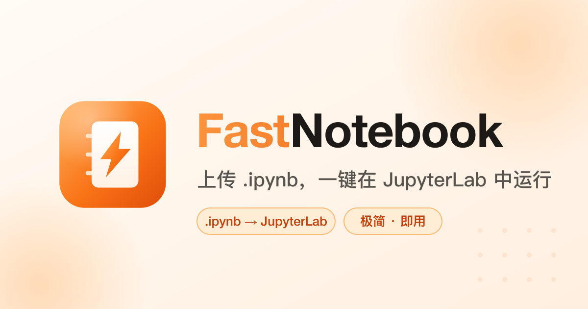
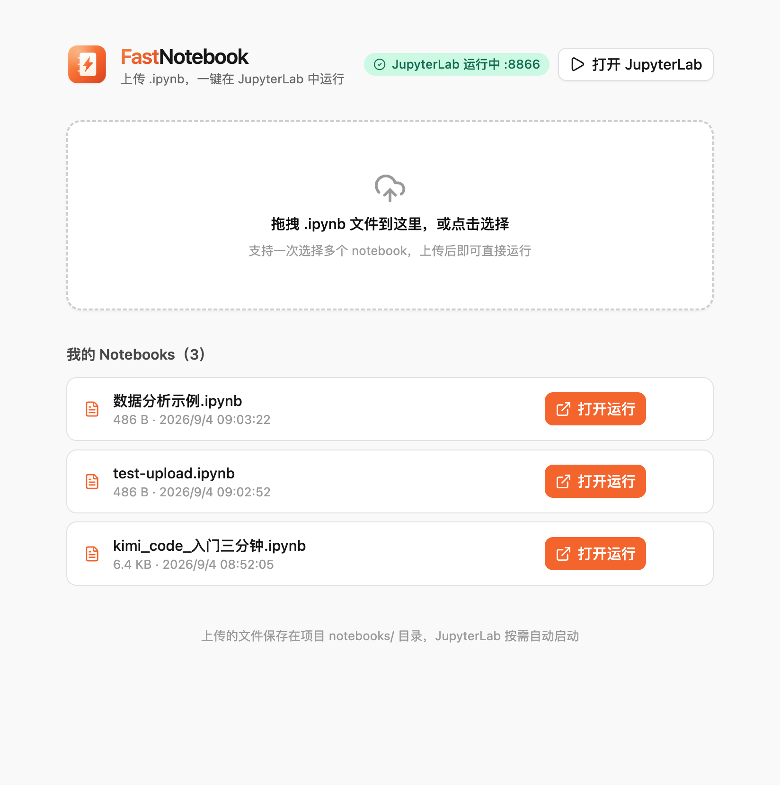

<div align="center">
  
  <br /><br />
  <p>
    <strong>极简 notebook 托管平台</strong> —— 拖入本地 <code>.ipynb</code> 文件，一键在 JupyterLab 中打开运行
  </p>
</div>

---

## 功能特性

- **拖拽上传**：支持多选、中文文件名，上传即校验 `nbformat` 合法性，同名文件自动覆盖
- **一键运行**：点击「打开运行」，JupyterLab 按需自动启动并直达对应 notebook 页面
- **实例复用**：服务重启后自动收养遗留的 JupyterLab 实例；token 持久化，旧链接永久有效
- **域名 / IP 全局一致**：JupyterLab 打开链接与 OG 分享卡片均跟随访问者使用的 Host，隧道内外表现一致
- **生产级常驻**：launchd 托管，开机自启、崩溃自愈（`KeepAlive`）



## 架构

```
浏览器 ──► FastNotebook 服务 (Node, 0.0.0.0:7100)
              ├── 静态托管 dist/（React 前端）
              ├── /api/* 上传 / 列表 / 删除 / 打开
              └── 按需拉起 JupyterLab (0.0.0.0:8866，token 鉴权)
                        └── root_dir = notebooks/
```

| 端口 | 用途 | 说明 |
|---|---|---|
| `7100` | 平台入口（前端 + API） | 对外服务端口 |
| `8866`–`8876` | JupyterLab | 自动挑选空闲端口，链接中带 token |

## 快速开始

### 生产模式（常驻服务，推荐）

```bash
npm install                # 首次
python3 -m venv .venv      # 首次：独立 Python 环境
.venv/bin/pip install jupyterlab
npm run build              # 构建前端到 dist/
npm run start              # 0.0.0.0:7100 单进程托管（前端 + API）
```

### 开发模式

```bash
npm run dev                # 同时拉起后端(:8891)与 Vite(:7100)，支持 HMR
npm run dev -- --port 8080 # 参数原样转发给 Vite
```

## 常驻服务（launchd, macOS）

服务配置：`~/Library/LaunchAgents/com.fastnotebook.plist`

```bash
launchctl kickstart -k gui/$(id -u)/com.fastnotebook   # 重启
launchctl bootout  gui/$(id -u)/com.fastnotebook       # 停止并卸载
launchctl print    gui/$(id -u)/com.fastnotebook       # 查看状态
```

日志位置：

| 日志 | 路径 |
|---|---|
| 服务日志 | `.fastnotebook/service.out.log` / `service.err.log` |
| JupyterLab 日志 | `.fastnotebook/jupyter.log` |

## 目录结构

```
FastNotebook/
├── server/index.mjs      # 后端：上传 API + 静态托管 + JupyterLab 进程管理（零依赖）
├── scripts/dev.mjs       # 开发模式：前后端一键同启
├── src/App.tsx           # 前端单页（React + Tailwind + shadcn/ui）
├── notebooks/            # 上传的 .ipynb 落盘目录（JupyterLab root_dir）
├── .fastnotebook/        # 运行时状态：token / 日志
├── .venv/                # 独立 Python 环境（JupyterLab 4）
├── public/               # 品牌资产（见下）
└── docs/                 # 文档截图
```

## 品牌资产

所有视觉资产均由 `public/logo.svg` 单一矢量源派生，全局一致：

| 文件 | 用途 |
|---|---|
| `public/logo.svg` | 主 LOGO（徽章：笔记本 + 闪电），页首与 favicon 共用 |
| `public/favicon.ico` | 浏览器标签页（16/32/48 多尺寸） |
| `public/apple-touch-icon.png` | iOS 主屏幕 180px |
| `public/icon-192.png` / `icon-512.png` | PWA / Android |
| `public/site.webmanifest` | PWA 清单（主题色 `#F97316`） |
| `public/og.svg` → `public/og-image.png` | OG 分享大图 1200×630 |

重新生成全套尺寸：

```bash
for s in 16 32 48 180 192 512; do rsvg-convert -w $s -h $s public/logo.svg -o public/logo-$s.png; done
rsvg-convert -w 1200 -h 630 public/og.svg -o public/og-image.png
```

## API 速览

| 方法 | 路径 | 说明 |
|---|---|---|
| `GET` | `/api/status` | 服务与 JupyterLab 状态 |
| `GET` | `/api/notebooks` | notebook 列表 |
| `POST` | `/api/upload?name=xx.ipynb` | 上传（body 为 notebook JSON，≤64MB） |
| `POST` | `/api/open` | `{name}` → 返回带 token 的 JupyterLab 直达链接 |
| `POST` | `/api/jupyter/start` | 确保 JupyterLab 运行，返回主页链接 |
| `DELETE` | `/api/notebooks?name=xx.ipynb` | 删除 |

> 注意：URL 中的非 ASCII 文件名需先 URL 编码。

## 安全说明

- JupyterLab 使用持久化 token 鉴权（`.fastnotebook/token`，权限 0600）
- 平台设计运行于内网 / WireGuard 等私有隧道环境；**请勿将 7100 / 8866 直接暴露公网**
- 远程访问需同时放行平台端口（7100）与 JupyterLab 端口段（8866–8876）
